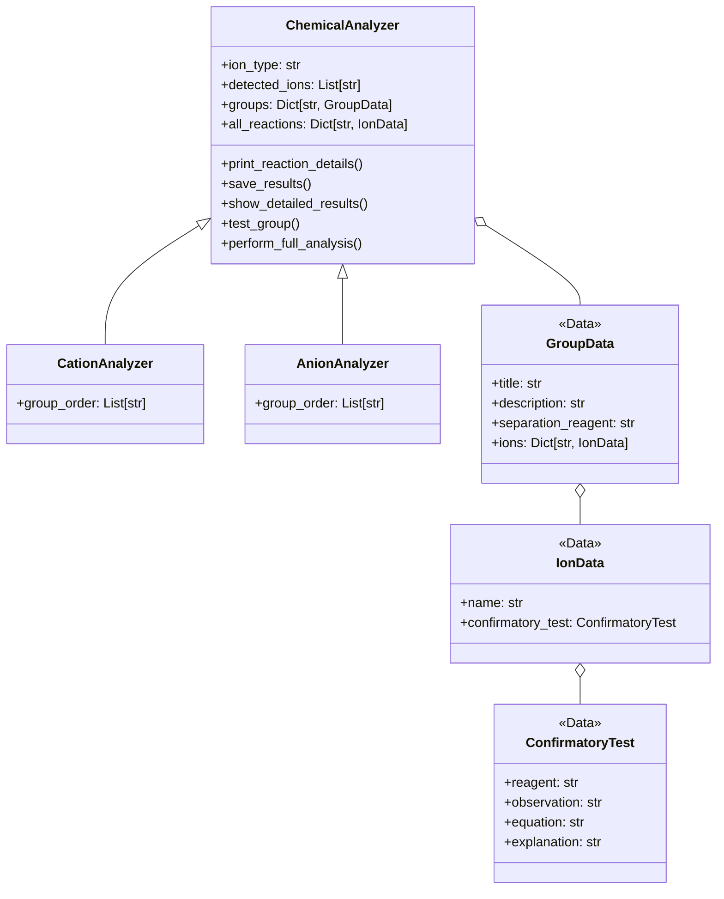

## 📌 Overview
A Python-based simulator for systematic qualitative inorganic analysis, implementing a modern database-driven approach for cation (Groups I-V) and anion (Groups I-III) identification.

## 🏗️ System Architecture

### Class Diagram


### Key Components
| Component           | Description                                |
|---------------------|--------------------------------------------|
| `ChemicalAnalyzer`  | Base class with core analysis functionality|
| `CationAnalyzer`    | Handles all 5 cation group tests           |
| `AnionAnalyzer`     | Manages 3 anion group analyses             |
| `ReactionData`      | Stores test metadata and chemical equations|

## 🚀 Quick Start
1. **Clone the repository**:
   ```bash
    git clone https://github.com/zainurrifaim/cation_and_anion_qualitative_analysis.git
    cd cation_and_anion_qualitative_analysis/analysis-app-v2
   ```

2. **Run the analyzer**:
   ```bash
    python analysis_app.py
   ```

3. **Follow the interactive prompts** to perform analyses.

## 🧪 Example Workflow
```text
=== CATION ANALYSIS: GROUP I - HCl Group ===
Description: Cations forming insoluble chlorides
Separation Reagent: Dilute HCl

Possible ions: Pb²⁺, Ag⁺, Hg₂²⁺
Did precipitation occur? [y/n]: y

Testing for Pb²⁺:
Reagent: Hot water + K₂CrO₄
Expected Observation: Yellow precipitate
Did you observe this result? [y/n]: y
```

## 🛠️ Development

### Data Validation Rules
| Input Type       | Validation                      | Example          |
|------------------|---------------------------------|------------------|
| Yes/No           | Must be 'y' or 'n'              | "y" → valid      |
| Color Observation| Must be in predefined list      | "green" → reject |
| Ion Selection    | Must exist in reaction database | "Pb²⁺" → valid   |

### Extending the System
**To add new ions**:
```"Group II": {
    "title": "...",
    "ions": {
        "Cu²⁺": {
            "name": "Copper(II)",
            "confirmatory_test": {
                "reagent": "Excess NH₄OH",
                "observation": "Deep blue solution",
                "equation": "Cu²⁺ + 4NH₃ → [Cu(NH₃)₄]²⁺",
                "explanation": "Tetraammine copper(II) complex formation"
            }
        }
    }
}
```

## 📜 License
MIT License. See [LICENSE](LICENSE) for details.
```
