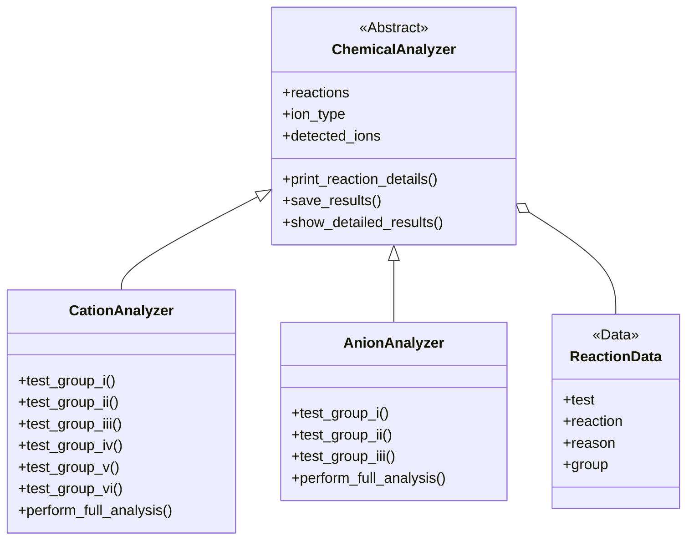

## 📌 Overview
A Python-based simulator for systematic qualitative inorganic analysis, replicating traditional wet-lab procedures for cation (Groups I-VI) and anion (Groups I-III) identification.

## 🏗️ System Architecture

### Class Diagram


### Key Components
| Component           | Description                                |
|---------------------|--------------------------------------------|
| `ChemicalAnalyzer`  | Base class with core analysis functionality|
| `CationAnalyzer`    | Handles all 6 cation group tests           |
| `AnionAnalyzer`     | Manages 3 anion group analyses             |
| `ReactionData`      | Stores test metadata and chemical equations|

## 🚀 Quick Start
1. **Clone the repository**:
   ```bash
   git clone https://github.com/zainurrifaim/cation_and_anion_qualitative_analysis.git
   cd cation_and_anion_qualitative_analysis
   ```

2. **Run the analyzer**:
   ```bash
   python cation_and_anion_qualitative_analysis.py
   ```

3. **Follow the interactive prompts** to perform analyses.

## 🧪 Example Workflow
```text
=== CATION ANALYSIS: GROUP I ===
Add dilute HCl to the solution...
Did a white precipitate form? [y/n]: y

Testing for Pb²⁺:
Reaction: Pb²⁺ + CrO₄²⁻ → PbCrO₄↓ (yellow)
Scientific Principle: Ksp = 2.8×10⁻¹³
```

## 🛠️ Development

### Data Validation Rules
| Input Type       | Validation                      | Example          |
|------------------|---------------------------------|------------------|
| Yes/No           | Must be 'y' or 'n'              | "y" → valid      |
| Color Observation| Must be in predefined list      | "green" → reject |
| Ion Selection    | Must exist in reaction database | "Pb²⁺" → valid   |

### Extending the System
**To add new ions**:
```python
CATION_REACTIONS["Cu⁺"] = {
    "test": "NH₄OH dissolution",
    "reaction": "Cu⁺ + 4NH₃ → [Cu(NH₃)₄]⁺",
    "reason": "Complex formation (Kf = 1.1×10⁷)",
    "group": "II"
}
```

## 📜 License
MIT License. See [LICENSE](LICENSE) for details.
```
